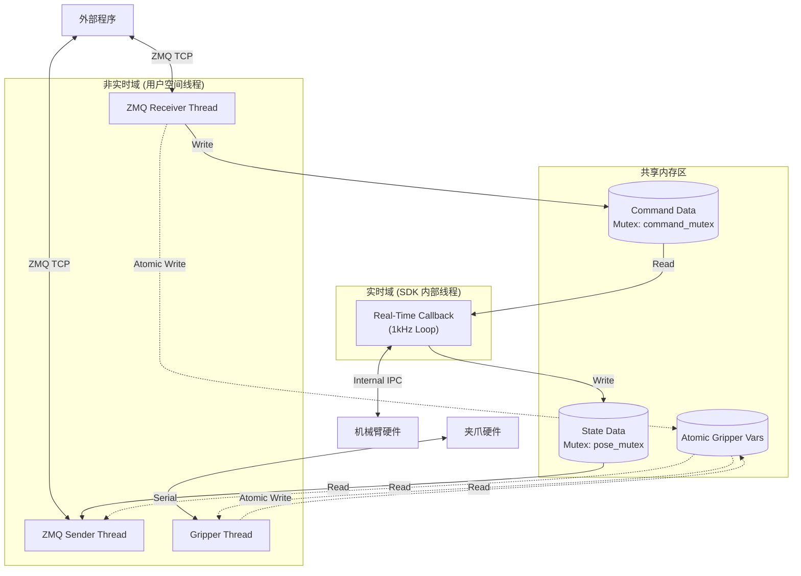

# Rokae Imitation 控制系统架构技术文档

本文档详细描述了 `rokae_imitation` 项目中控制程序（主要基于 `src/all_control.cpp`）的系统架构，重点阐述多线程模型、数据流向以及实时控制回调与外部通讯的嵌套关系。

## 1. 系统概览

该系统设计为一个典型的**生产者-消费者**模型，旨在实现对 Rokae xMateErPro 机械臂的实时控制。系统通过 ZeroMQ (ZMQ) 接口与外部算法（如强化学习策略或上位机规划器）交互，同时通过 Rokae SDK 的实时回调接口以高频率（~1kHz）控制机械臂运动。

## 2. 线程架构详解

程序运行时主要包含 **4 类关键线程**。这些线程在 `main` 函数中初始化或启动，但并行运行，各司其职。

### 2.1. 主线程 (Main Thread)
*   **生命周期**：程序启动至结束。
*   **职责**：
    1.  **初始化**：配置 ZMQ 地址、机器人连接参数（IP）、控制模式（笛卡尔/关节空间、阻抗/位置模式）。
    2.  **机器人设置**：连接机器人，上电，设置 TCP（工具中心点），移动到初始姿态。
    3.  **启动子线程**：创建并启动夹爪控制线程、ZMQ 接收线程、ZMQ 发送线程。
    4.  **启动实时循环**：注册控制回调函数 (`setControlLoop`) 并启动 (`startLoop`)。
    5.  **阻塞等待**：`std::cin.get()` 阻塞主线程，防止程序退出，直到用户按键。
    6.  **资源清理**：停止循环，回收线程，机器人下电。

### 2.2. ZMQ 命令接收线程 (ZMQ Receiver Thread)
*   **定义位置**：`main` 函数内的 Lambda 表达式 `zmq_receiver`。
*   **启动方式**：`std::thread zmq_receiver_thread(zmq_receiver);`
*   **嵌套关系**：**完全独立于实时控制回调**。
*   **职责**：
    *   监听 `tcp://localhost:5555`。
    *   以非阻塞方式 (`dontwait`) 接收 JSON 格式的控制指令。
    *   **关键交互**：
        *   解析 JSON 数据（速度 `xyzrpy_vel`、位姿矩阵 `pose_mat` 或关节角 `joint_pose`）。
        *   **获取锁 (`command_mutex`)**。
        *   更新共享变量（如 `cartesian_velocity_cmd`）。
        *   更新心跳时间 (`last_message_time`) 用于超时检测。
        *   **释放锁**。

### 2.3. ZMQ 状态发布线程 (ZMQ Sender Thread)
*   **定义位置**：`main` 函数内的 Lambda 表达式 `zmq_sender`。
*   **启动方式**：`std::thread zmq_sender_thread(zmq_sender);`
*   **嵌套关系**：**完全独立于实时控制回调**。
*   **职责**：
    *   绑定 `tcp://localhost:5556`。
    *   周期性运行（由 `zmq_pub_duration` 控制，例如 50ms）。
    *   **关键交互**：
        *   **获取锁 (`pose_mutex`)**。
        *   读取最新的机器人状态（`current_posture`, `current_joint`）。
        *   **释放锁**。
        *   读取原子变量 `gripper_position`。
    *   打包 JSON 并发布消息。

### 2.4. 夹爪控制线程 (Gripper Thread)
*   **定义位置**：`main` 函数内的 Lambda 表达式 `gripper_controller`。
*   **启动方式**：`if (use_gripper) std::thread control_thread(gripper_controller);`
*   **职责**：
    *   独立处理串口通信（IO 密集型操作）。
    *   读取原子变量 `gripper_velocity_cmd` 计算目标位置。
    *   通过串口指令控制夹爪并更新 `gripper_position`。

### 2.5. 实时控制回调线程 (Real-Time Control Callback Thread)
*   **定义位置**：`main` 函数内的 Lambda 表达式 `callback_cart` (笛卡尔) 或 `callback_joint` (关节)。
*   **执行者**：**Rokae SDK 内部的高优先级实时线程**。不是由用户代码直接 `std::thread` 创建，而是通过 `rtCon->setControlLoop` 注入。
*   **嵌套关系**：**严禁在此线程内进行 ZMQ 通讯、文件 IO 或耗时的计算**。
*   **职责**：
    1.  **获取状态**：调用 `robot.posture()` 或 `robot.jointPos()` 获取当前机械臂状态。
    2.  **更新共享状态 (写)**：
        *   **获取锁 (`pose_mutex`)**。
        *   将当前状态写入 `current_posture` 和 `current_joint`，供 **ZMQ Sender Thread** 读取。
        *   **释放锁**。
    3.  **获取控制指令 (读)**：
        *   **获取锁 (`command_mutex`)**。
        *   读取 `cartesian_velocity_cmd` 等指令。
        *   检查指令超时状态 (`zmq_recv_timeout`)。
        *   **释放锁**。
    4.  **控制律计算**：
        *   如果是 `xyzrpy_vel` 模式：根据速度指令进行积分，计算下一时刻的目标位姿矩阵 (`target_pose_matrix`)。
        *   处理坐标系变换（工具坐标系 vs 基坐标系）。
    5.  **返回指令**：返回 `rokae::CartesianPosition` 或 `rokae::JointPosition` 给 SDK 底层。

## 3. 线程间通信与数据流 (Data Flow)

系统通过 **共享内存 + 互斥锁 (Mutex)** 的方式在非实时通讯线程和实时控制线程之间传递数据。

### 3.1. 控制指令流 (下行)
`外部程序` -> (ZMQ TCP) -> **ZMQ Receiver Thread** -> [互斥锁 `command_mutex`] -> `共享变量 (XXX_cmd)` -> [互斥锁 `command_mutex`] -> **Real-Time Callback** -> `Rokae Controller`

*   **ZMQ Receiver** 负责**写**。
*   **Real-Time Callback** 负责**读**。
*   **注意**：Callback 内部进行了超时检测，如果 ZMQ 数据太久未更新，会自动将速度置零，保证安全。

### 3.2. 状态反馈流 (上行)
`Rokae Controller` -> **Real-Time Callback** -> [互斥锁 `pose_mutex`] -> `共享变量 (current_XXX)` -> [互斥锁 `pose_mutex`] -> **ZMQ Sender Thread** -> (ZMQ TCP) -> `外部程序`

*   **Real-Time Callback** 负责**写**（从 SDK 获取最新数据写入共享变量）。
*   **ZMQ Sender** 负责**读**（读取共享变量并发送）。

## 4. 架构图解 (示意)

## 5. 关键设计总结

1.  **通讯与控制解耦**：ZMQ 通讯完全剥离在实时循环之外。如果直接在 `callback` 中做 ZMQ `recv`，网络波动会导致实时循环超时（Rokae 控制器要求严格的 1ms 周期），进而导致机械臂报错或急停。
2.  **线程安全**：所有跨线程共享的数据（指令、状态）都严格受到 `std::mutex` 保护。夹爪数据量小且逻辑简单，使用了 `std::atomic`。
3.  **超时安全机制**：实时回调内部维护了时间戳检查。虽然 ZMQ 线程负责接收，但“是否超时”的判断逻辑放在了实时回调中，直接作用于控制指令，确保通讯中断时机器人能立即响应（停止）。
